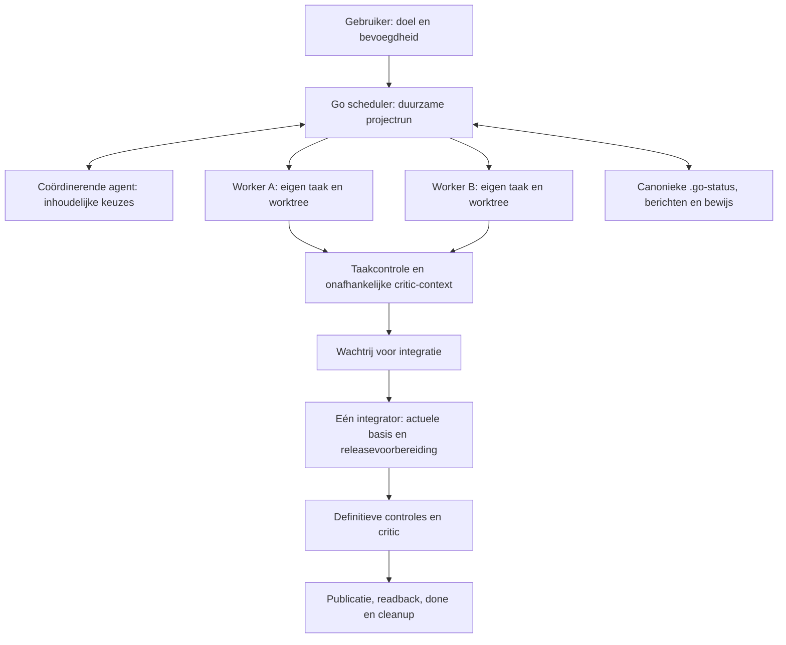

# Go project orchestration — ontwerp

Datum: 2026-09-18. Status: **voorgesteld; niet geïmplementeerd**.
Opdracht: ontwerp parallelle uitvoering binnen één project, waarbij Go workers
start, voortgang bewaakt en iedere releaseplichtige taak volledig aflevert.
Dit document autoriseert geen uitvoering, modelgebruik, publicatie of migratie.
Architectuurbrief: `../architecture/briefs/project-orchestration.json`.

## 1. Gebruikerservaring en grens

Gewenste opdracht, nog geen ondersteunde CLI-syntaxis:

> Go, voer deze epic uit met maximaal twee parallelle workers. Gebruik de
> modellen en releasebevoegdheden die bij de taken staan.

Go selecteert uitvoerbare taken, maakt eigen branches/worktrees, start workers,
toont voortgang en levert gecontroleerd op. Alleen ontbrekende bevoegdheid of
een materiële productbeslissing buiten het mandaat komt terug bij de gebruiker.
Geen vraag per workerstart, test, routinekeuze of al toegestane push.

Eerste versie: één repository op één host, maximaal twee bouwende/reparerende
workers, native Codex CLI-adapter, één integratie- en releasekanaal. Seriële
uitvoering blijft de standaard zonder expliciete parallelle projectrun.
Geen zichtbare Codex-app-taak per worker nodig. Een app-adapter is later mogelijk;
tools van de huidige chat zijn geen automatisch beschikbare Go-runtime-API.

Iedere releaseplichtige taak behoudt haar eigen release en bewijs. Parallel
bouwen betekent niet dat een worker zelfstandig naar main of productie pusht.
Onderzoek en andere taken met een expliciete no-release-policy behouden die policy.

## 2. Wat bestaat al, wat ontbreekt

Baseline: stack v0.3.33, inspectie van main `2c18d2a81576570831fa338747b6a9810e360865`.

| Bestaand onderdeel | Ontwerpdelta |
| --- | --- |
| `capacity_policy.py`: advies over disjuncte modify-scopes | Toelating tijdens daadwerkelijke dispatch, plus afhankelijkheden en resources |
| `run_state.py`: één hervatbare managed taak | Projectrun die meerdere taakruns bestuurt; tweede actieve taak alleen met gecontroleerde toelating |
| `worktrees.py`: eigenaarschap, execution- en integration-locks | Parallelle taakwerkplekken en gecontroleerde aansluiting op veranderde main |
| `cli.py` + adapters: verse workers per fase, profiel en context | Starten, stoppen en verzamelen vanuit een duurzame scheduler |
| `completion.py`: inhoudsgebonden checks/critic | Voorlopig bouwbewijs onderscheiden van definitief bewijs na integratievoorbereiding |
| `release.py`: versie, reservation, publicatie en readback | Eén integratiewachtrij; versievoorbereiding pas wanneer kandidaat aan de beurt is |
| Canonieke `.go`, locks en process-group/liveness checks | Projecteigenaarschap en journal voor dispatch, berichten en herstel |

Concrete huidige blokkades: `_execute_managed` weigert starten bij iedere andere
actieve taak; `select_managed_task` kiest één taak; de oude loop is sequentieel;
`integration_slot` en `prepare_release` eisen de oorspronkelijke exacte basis.
`AGENTS.md` schrijft één taak tegelijk voor. Dit ontwerp verandert die contracten
pas na implementatie en bewijs; huidige instructies blijven gelden.

## 3. Rollen en verantwoordelijkheden



- **Scheduler (gewone code):** toelating, identiteit, werkplekken, dispatch,
  resourceboekingen, deadlines, checkpoints, gebeurtenissen en herstel.
- **Coördinerende agent (op afroep):** taakafbakening, ontwerpvragen en inhoudelijke
  conflictvoorstellen. Geen verplicht permanent modelproces en geen bypass van gates.
- **Worker:** bouwt/repareert binnen eigen scope; meldt bewijs, vragen en blokkades.
- **Critic:** verse context, read-only; beoordeelt originele R# en kandidaat.
- **Integrator:** sluit één kandidaat aan op main en verzorgt haar lifecycle.
  Git-handeling en publicatie zijn gecontroleerde runtime-operaties; een model
  helpt bij inhoudelijke conflicten binnen het bestaande mandaat.

Rollen zijn geen verplicht afzonderlijke agents. De leidende sessie kan de
coördinatiefunctie vervullen. Die mag verdwijnen zonder verlies van runstatus.
Workerprocessen schrijven geen canonieke taken, beslissingen of release-status.
Taakspecifieke supervisors mogen alleen hun gebonden proces-/fasebewijs opslaan
via de gecontroleerde runtime; de scheduler verwerkt de canonieke transitions.

## 4. Toelating en capaciteit

Een taak is klaar voor dispatch wanneer haar contract geldig is, besluiten en
uitvoeringsafhankelijkheden zijn voldaan, profiel beschikbaar is, bevoegdheid
past en vereiste resources beschikbaar zijn. De eerste geblokkeerde taak mag
andere onafhankelijke taken niet onnodig tegenhouden. Prioriteit plus wachttijd
bepaalt de volgorde; een expliciete eerdere afhankelijkheid gaat altijd voor.

Capaciteit wordt onder één korte admission-lock opnieuw berekend en gereserveerd
voordat een worker start. Losse handmatige starts mogen niet naast de scheduler
langs sluipen: zij moeten dezelfde admission volgen of wachten op de projectrun.
De bestaande tweede-actieve-taak-gate vervalt uitsluitend voor die gebonden runs.
Alle andere veiligheidsgates blijven behouden.

Scope krijgt twee onderscheiden verantwoordelijkheden, als voorgestelde uitbreiding:

- **Worker-scope:** nauwkeurige productpaden die de builder mag wijzigen.
- **Controller-scope:** expliciete versie/changelogpaden voor releasevoorbereiding.
  Deze vallen nog steeds binnen de totale geautoriseerde task modify-scope.

Alleen als de publisher die tweede scope exclusief bezit én workerwijzigingen
daar hard weigert, mag de planner deze paden buiten worker-overlap laten.
Legacy taken krijgen geen impliciete nieuwe rechten. Brede/ambigue scopes blijven
serieel totdat de taakafbakening inhoudelijk is aangescherpt.

Disjuncte bestanden bewijzen geen inhoudelijke onafhankelijkheid. Gedeelde API's,
schema's, gegenereerde code en migraties moeten expliciete afhankelijkheden of
exclusieve resourceclaims krijgen. Bekende gedeelde databases/poorten/testdata
krijgen een namespace per taak of een exclusieve lease. Onbekende noodzakelijke
isolatie betekent seriële uitvoering. Arbitrary hostile subprocess sandboxing
valt buiten v1; worktrees isoleren Git-bestanden, niet het hele systeem.

Voorgestelde beginlimieten: twee build/repair-processen, één criticproces, één
integrator en maximaal drie modelprocessen totaal. Integratiereparatie gebruikt
een bestaande builderslot. Klaarstaande kandidaten begrenzen op twee om grote
hoeveelheden verouderde branches te voorkomen. Limieten zijn verlaagbaar binnen
de run; verhogen vraagt bestaande expliciete capaciteit/budget, geen stille schaalvergroting.

## 5. Duurzame status en berichten

Voorgestelde opslag; dit zijn **geen bestaande runtime-schema's**:

```text
.go/orchestration/<project-run>/
  state.json       # projectrun, policy, bindingen, queue en budget
  events.jsonl     # dispatch-/herstel-/berichtgeschiedenis
  messages/        # begrensde, geadresseerde berichten en bevestigingen
.go/runs/<task>/   # bestaande gezaghebbende fase-/completion-/releasegegevens
.go/workspaces/    # bestaande workspace-identiteiten
```

Het projectregister verwijst naar task-id, run-id, worker/workspace-generation,
modelbinding, kandidaat-SHA en taskstatusrevision; het kopieert geen tweede
waarheid over done of release. Status voor de gebruiker is een afgeleide weergave.
Proceslocks blijven in de Git common directory zoals nu.

Projectfasen: `running`, `draining`, `paused`, `blocked`, `completed`, `cancelled`.
Per geselecteerde taak toont de scheduler onder meer `waiting`, `building`,
`checking`, `ready_for_integration`, `reconciling`, `final_verifying`, `publishing`,
`done` of `blocked`. Dit zijn runfasen; bestaande open/active/blocked/done en
review_status blijven de publieke taaklifecycle. Een bouwresultaat is nooit done.

Een bericht bevat een unieke message-id, afzender/ontvanger en hun run/generation,
correlation-id, type, broncontextrevision, tekst of artifactref/hash en tijd.
Typen: vraag, antwoord, blokkade, contractvoorstel en kandidaat beschikbaar.
De runtime verifieert identiteit en ontvanger, schrijft vóór bezorging en dedupliceert
bij herhaling. Workerproza geldt niet als vertrouwde runtime-identiteit.

V1 bezorgt berichten bij fasegrenzen via de bestaande contextsnapshot. Een worker
kan een vraag retourneren en later met een nieuwe snapshot hervatten. We beloven
geen live injectie in een lopend ephemeral CLI-proces. Direct agentoverleg via
een geschikte host-adapter mag later; taak-/scope-/besluitwijzigingen worden pas
bindend na gecontroleerde verwerking in canonieke records. Een bericht heft een
`requires: done`-afhankelijkheid niet op en geeft geen publicatiebevoegdheid.

Geen megacontext: elke worker krijgt eigen taak, geldende besluiten, noodzakelijke
interfaces, relevante beantwoorde berichten, huidige kandidaat en gerichte feedback.
Berichten van oude generaties blijven auditbaar maar sturen nieuwe workers niet
zonder expliciete herbevestiging. Wachtcycli worden zichtbaar als dependency cycle;
de scheduler meldt die aan de coördinator in plaats van eindeloos agents te laten wachten.

## 6. Integratie en een volledige release per taak

Voorbeeld: A en B beginnen op commit C0. A wordt v1.2; B wordt daarna v1.3.

1. Workers leveren een gecommitteerde kandidaat plus voorlopig gecontroleerd
   resultaat. De scheduler houdt task-owned inhoud en oorspronkelijke basis bij.
2. De integrator reserveert één beurt. Bouwen van andere taken mag doorgaan.
3. Na A's publicatie leest B de actuele lokale én remote basis. Bij onverwachte
   externe wijzigingen wordt eerst reconciliatie uitgevoerd; geen force-push.
4. De integrator voegt de actuele basis history-preserving in B's worktree samen.
   **V1 gebruikt merge, geen rebase/squash**, passend bij het bestaande ancestry-proof.
   Conflicten blijven staan voor gebonden reparatie; geen stil ours/theirs-keuze.
5. Behoud oorspronkelijke basis, worker-head, nieuwe basis en reconciliatiecommit
   in een nieuwe gecontroleerde workspace/context-generation. Alleen een nieuwe
   base-SHA in metadata schrijven is onvoldoende bewijs.
6. Controleer taakwijzigingen ten opzichte van de nieuwe integratiebasis. Geërfde
   wijzigingen van A mogen niet als B's scope-overtreding tellen. Controleer daarnaast
   de oorspronkelijke workerdelta en alle conflictresoluties; een merge mag geen
   buiten-scope verandering, teruggedraaide wijziging van A of gebruiker-dirt verbergen.
7. Reserveer de volgende versie en bereid changelog/versie voor. Voer alle verklaarde
   definitieve checks en critic uit op deze volledige kandidaat. Voorlopig bewijs
   blijft historie en mag niet als bewijs voor deze gewijzigde inhoud dienen.
8. Publiceer via bestaande intent/readback-logica, verifieer release en eventuele
   deployment, sluit R# af, keur de taak goed en voer gecontroleerde cleanup uit.

De basis omvat ook eventuele controller-checkpointcommits. Alleen de controller
legt zijn eigen `.go`-wijzigingen expliciet vast; nooit een brede `git add` die
gebruikerswerk meeneemt. Een vereiste schone integratiecheckout met gebruikerswerk
blijft geblokkeerd. Tracked `.go`-kopieën in workers zijn inert: eventuele conflicten
bij het binnenhalen van control-state worden door de controller uit de canonieke
records opgelost, niet door de builder. Resolutie en staging moeten productdelta
en controllerdelta afzonderlijk toeschrijven en controleren. Pure checkpointwijzigingen
hoeven inhoudsgebonden productbewijs niet ongeldig te maken als de bestaande
bindingscontrole bevestigt dat code, taakcontract en relevante context gelijk bleven.

De integrator is logisch gereserveerd vanaf selectie tot readback of bewezen veilige
vrijgave. Houd geen algemene state-lock vast tijdens modelcalls/tests/netwerkwerk;
gebruik korte locks voor transitions en een duurzame release-reservation voor
exclusiviteit. Voor de daadwerkelijke Git-integratie gelden de bestaande locks.
Een gewijzigde remote basis vóór push maakt de kandidaat opnieuw ongeldig.

Een onbekend publicatieresultaat blokkeert het kanaal tot readback het effect
vaststelt. Een mislukte kandidaat vóór externe effecten kan na vastgelegde abort
en opruimen van uitsluitend eigen versievoorbereiding haar beurt afstaan; dan kan
een onafhankelijke taak door. Een reservation wordt nooit alleen op leeftijd gewist.
Maximaal twee automatische reconciliatiepogingen per kandidaat in v1; daarna
zichtbare blokkade voor die taak, met behouden werk en de exacte reden.

## 7. Herstel, stoppen en budget

Eén projectcontroller bezit een OS-lock plus host/process-identiteit en generation.
Een heartbeat is informatief; verlopen tijd bewijst geen dode worker. Een nieuwe
controller gebruikt bestaande process-group/livenesschecks en leest onafgeronde
dispatch- en publicatie-intents terug. Een onbekende host/processituatie blokkeert
overname. Cross-host recovery valt buiten v1.

Dispatch schrijft eerst intent en worker-nonce; de child registreert zich vóór
productwrites. Dubbele dispatch/start/berichtverwerking wordt gededupliceerd.
Een herstart hergebruikt lopend werk alleen wanneer binding en procesbewijs dat
toelaten; anders wacht of stopt hij de eigen processgroup gecontroleerd. Geen
nieuwe writer naast een overlevende orphan en geen blind opnieuw uitvoeren van
een onbekend extern effect. Standalone workers kunnen hun fase afronden tijdens
controlleruitval, maar verkrijgen daarmee geen canonieke of releasebevoegdheid.

- **Pause/drain:** geen nieuwe dispatch; lopende fasen bereiken een checkpoint;
  geen nieuwe publicatie. Een al gestarte externe stap wordt eerst gelezen/hersteld.
- **Stop/cancel:** uitsluitend eigen processgroups beëindigen, werk behouden,
  geen cleanup van ongeleverde branches; taken zijn niet stilzwijgend done.
- **Budget op:** pauzeren met hervatbare bindingen. Geen stille budgetreset bij restart.

Projectbudget is gedeeld naast taakbudgetten. Reserveer capaciteit vóór dispatch;
tel commandolimieten op en meet project-walltime apart van opgetelde workerduur.
Tokengebruik alleen uit waargenomen runtimegegevens; ontbrekende usage is onbekend.
Geen harde euro-/tokenbudgetgarantie claimen zonder afdwingbare providergrens.
Rate limits beperken nieuwe dispatch; modelkeuze en effort wisselen nooit stil.

## 8. Besluiten en alternatieven

Alle keuzes hieronder zijn ontwerpvoorstellen; geen geaccepteerde decision-events.

| Keuze | Voorstel en reden |
| --- | --- |
| Coördinatie | Deterministische scheduler plus agent op afroep; dezelfde lifecycle blijft zonder chatsessie uitlegbaar |
| Basistopologie | Native CLI-workers; bestaande model/context/processcontrole hergebruiken |
| Parallelisme | Eerst twee builders op één host, expliciet opt-in; groei pas na gemeten voordeel |
| Communicatie | Duurzame berichten, v1 bezorging op fasegrenzen; live sessieadapter later |
| Integratie | Eén queue met history-preserving merge en nieuw definitief bewijs |
| Releasegranulariteit | Eigen release per releaseplichtige taak; geen impliciete batchrelease |
| Bevoegdheid | Projectrun kan task authority beperken, nooit verruimen; geen modelkeuze verleent pushrechten |

Alternatieven: meerdere los gestarte Go-sessies missen gezamenlijke admission en
reconciliatie; één LLM-manager die alles in chat onthoudt mist duurzaam herstel;
volledig decentrale agents kunnen werken, maar vragen een expliciet conflict- en
publicatieprotocol. Herdr/andere sessie-UI's zijn mogelijke bedieningslagen, geen
vervanging van deze repositorycontracten. Geen nieuwe terminal-UI bouwen voor v1.

Niet nodig voor v1: multi-host uitvoering, hot model switching, tweede provider,
speculatief bouwen op ongeleverde taken, nested autonome teams, permanente daemon,
automatische deployment naar ongekozen targets, GitHub Actions of een eigen chatproduct.
De scheduler draait expliciet foreground en is hervatbaar; detach/service later.

## 9. Implementatievolgorde — werkpakketten, nog geen taken

| ID | Afgebakend resultaat | Afhankelijk van | Bewijs |
| --- | --- | --- | --- |
| O1 | Projectruncontract, versie/migratiegrens, admission en authority | Ontwerpbesluiten vastleggen | Legacy serial ongewijzigd; dubbele admission geweigerd; resourceoverlap geblokkeerd |
| O2 | Aansluiten op gewijzigde basis met scope- en ancestry-proof | O1 | A/B op C0, A integreert, B merge + nieuw bewijs; conflict en buiten-scope merge geweigerd |
| O3 | Gecontroleerde projectdispatch met twee workers en gedeeld budget | O1, O2 | Werkelijke procesoverlap; vaste task/modelbindingen; queue/backpressure |
| O4 | Berichten op fasegrenzen en controllerherstel | O3 | Vraag/antwoord, dubbele bezorging, oude generation, crash/orphan en hervatten |
| O5 | Volledige integratie-/releasequeue en live pilot | O2, O3, O4 | Twee afzonderlijke releases, remote advance, onbekende pushuitkomst, readback en cleanup |
| O6 | Template-opt-in en uitleg voor gebruikers | O5 en gepubliceerde stackrelease | Verse clone, expliciete keuzes, serial default en parallel pilot zonder onderhoudstaken te erven |

Geen release van parallelle productie-uitvoering vóór O5 slaagt. Tussenversies
houden de functie expliciet uitgeschakeld. O6 hoort later bij de eigen lokale
planning van `go-project-template`; dit ontwerp wijzigt die repository niet.
Exacte JSON-velden/CLI-vlaggen en modulegrenzen worden in O1 vastgesteld. Die
technische keuzes zijn gedelegeerd zolang deze invarianten en migratiegrenzen blijven.

## 10. Acceptatie en falsificatie

| Scenario | Vereiste waarneming |
| --- | --- |
| Twee onafhankelijke taken | Overlappende buildintervallen van echte afzonderlijke processen, eigen branches en correcte resultaten |
| Scope/resource/dependencyconflict | Geen ongeautoriseerde gelijktijdige writes; duidelijke wachtreden |
| A geleverd terwijl B bouwt | B sluit aan op A, behoudt A, krijgt nieuw definitief bewijs en eigen volgende release |
| Conflicterende wijzigingen | Reparatie of expliciete blokkade; geen weggegooide wijzigingen of fictieve groene status |
| Controlleruitval bij dispatch/check/push | Geen dubbele writer/release; precieze hervatting of onbekend-effectblokkade |
| Worker hangt / quota op / budget op | Capaciteit en status kloppen; gecontroleerde stop/backoff; model blijft gebonden |
| Herhaalde/vertraagde berichten | Hoogstens één bindende verwerking; geen statuswijziging door oude generation |
| Gebruiker-dirt of externe main-update | Geen overschrijven/stagen; reconciliatie en passende herverificatie |
| Opt-out/legacy repository | Bestaande seriële opdrachten en historische records blijven bruikbaar |

Deterministische tests moeten echte processen, locks en crashpunten gebruiken.
Een CLI-double bewijst orchestrationtransport, geen modelkwaliteit. Een aparte
geautoriseerde live pilot moet echte modelruns, twee releases en fresh remote
readback tonen. Geen bewijs door alleen metadata met `parallel=true`.

Meet in een herhaalbare serial-versus-parallel pilot dezelfde onafhankelijke
werklast: totale tijd tot beide releases, piekactieve workers, modelgebruik,
integratie-/reparatietijd en benodigde gebruikersinterventies. Doel: lagere
doorlooptijd zonder slechter resultaat; geen algemene 2×-claim. Als publicatie,
tests of conflicten domineren, schaal workers niet verder op.

## 11. Open punten en bronbasis

Geen ontbrekende informatie blokkeert dit ontwerp. Vóór implementatie zijn de
voorgestelde architectuurkeuzes expliciet te bevestigen/vast te leggen; dit is
geen nieuwe verplichte menselijke approval per detail. Vóór de live pilot moeten
testproject, modelprofielen, budget en publicatiebevoegdheid concreet zijn.
Prijsinformatie of effectieve provideridentiteit wordt niet uit modelnamen afgeleid.

Bronnen, geraadpleegd in de voorafgaande ontwerpsessie:

- [DHH bij Lex Fridman](https://lexfridman.com/?p=6512), circa 1:34–1:38:
  meerdere sessies en menselijke coördinatie; geen bewijs voor zestien autonome
  releases in één repository.
- [Claude Academy: parallel sessions](https://academy.claude.com/courses/ai-native-sdlc-playbook/parallel-sessions-and-subagents):
  onafhankelijke taken, eigen worktrees, beheersbare reviewcapaciteit.
- [Carlini's compilerexperiment](https://www.anthropic.com/engineering/building-c-compiler):
  decentrale uitvoering; taakverdeling en testbaarheid bepalen bruikbaar parallelisme.
- Bestaande lokale contracten: `docs/task-workspaces.md`, `docs/worker-topologies.md`,
  `docs/state-safety.md`, `docs/task-release-contract.md`, `docs/task-design-readiness.md`.

Ontwerpreview: een permanente manager is niet vereist; bestanden alleen bewijzen
geen onafhankelijkheid; berichten vervangen geen canonieke besluiten; merge kan
scopebewijs vervalsen zonder nieuwe attribution; één release per taak blijft
serieel aan het einde. Deze vijf risico's zijn hierboven expliciet afgedekt.

## Prioriteit gewijzigd — 2026-09-19

Dit parallelle ontwerp is geparkeerd op basis van de nieuwe gebruikersrichting: betrouwbare seriële autonomie van taakverkenning tot live oplevering gaat voor parallelle builders. Zie `autonomy-first.json` en `autonomy-first.md`. Hergebruik de duurzame controller, mandaten, herstel en seriële releasebewijzen; implementeer nu geen tweede builder, berichtenbus of multi-host scheduling. De oorspronkelijke tekst hierboven blijft ontwerphistorie, geen uitvoeringsopdracht.
