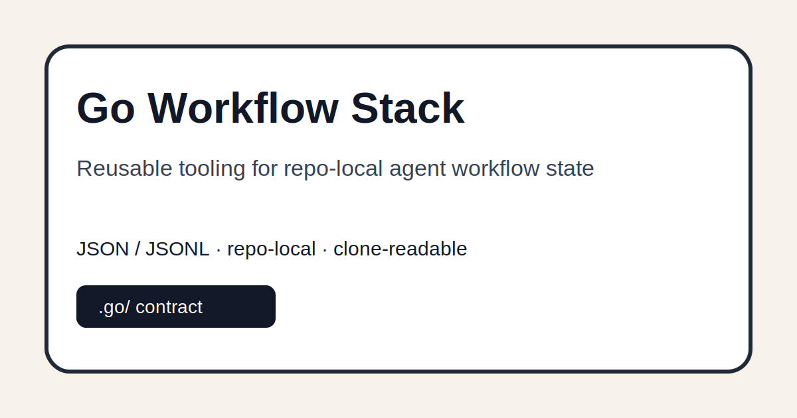

# Go Workflow Stack



Reusable tooling for repo-local agentic engineering.

The stack contains schemas, validators, fixtures, and a small CLI for projects that keep their own `.go/` JSON/JSONL state next to the code.

Projects may combine `required_stack_version` with an immutable `stack_ref` (`vX.Y.Z` or a full commit SHA). The minimum version protects compatibility; the ref makes bootstrap and cross-machine continuation reproducible.

## Why this exists

Agent work should be clone-readable. A future agent should be able to inspect a repository and understand its project state without needing a central vault task database.

## Repository roles

- **This repo (`go-workflow-stack`)**: reusable workflow tooling.
- **Template repo ([`go-project-template`](https://github.com/viggomeesters/go-project-template))**: starter `.go/` project-state structure.
- **Project repos**: own their `.go/` state and evidence.

For the full practical architecture and application flow, see [`docs/practical-architecture.md`](docs/practical-architecture.md). For the user-facing go/GO/GOO command router, see [`docs/go-command-router.md`](docs/go-command-router.md). For the current `$go-*` bridge status, see [`docs/go-bridge-status.md`](docs/go-bridge-status.md). For v0.2+ authoring commands, see [`docs/authoring-primitives.md`](docs/authoring-primitives.md). For clone-safe bundle handoffs, see [`docs/export-import-bundles.md`](docs/export-import-bundles.md). Versioned state upgrades and agent integrations are documented in [`docs/contract-migrations.md`](docs/contract-migrations.md) and [`docs/agent-adapter-protocol.md`](docs/agent-adapter-protocol.md).

Routing rule: a target repo must own a valid `.go/project.json` before workflow execution starts. Repositories without that contract fail closed and must use `adopt` or `spike`; a vault is never an execution fallback.

## Practical architecture in one minute

Use this stack when you want reusable commands and validation. Use [`go-project-template`](https://github.com/viggomeesters/go-project-template) when you want to start a new repo that already carries its own `.go/` state. A real project should copy/adapt the template and then keep tasks, evidence, decisions, and architecture principles in its own repository.

```text
go-workflow-stack  -> validates/operates -> project repo with .go/
go-project-template -> seeds/copies ------^
```

## Install / usage

Clone this repository next to a project repository:

```bash
git clone https://github.com/viggomeesters/go-workflow-stack.git
git clone https://github.com/viggomeesters/go-project-template.git
cd go-workflow-stack
make check
```

Or install the standalone console command; its wheel carries the schemas and minimal fixture and needs no sibling checkout at runtime:

```bash
uv tool install --from . go-workflow-stack
go-workflow version --json
go-workflow validate /path/to/project
```

Run the CLI against a repo-local `.go/` project:

```bash
python3 cli/go.py validate ../go-project-template
python3 cli/go.py readback ../go-project-template
python3 cli/go.py next ../go-project-template
```

Check the public template/stack pairing explicitly:

```bash
python3 cli/go.py template-check ../go-project-template --json
```

Initialize a fresh repo with the current minimal fixture:

```bash
python3 cli/go.py init ../my-project --force
```

Apply the public template's `.go/` structure to an existing repo:

```bash
GO_PROJECT_BRIEF="What this project must achieve" bash scripts/apply-template.sh ../my-project
```

The apply command validates the paired template and then creates a project-specific `.go` identity, vision, hierarchy, and task set. It does not leave the target pretending to be `go-project-template`.

## CLI commands

- `router <repo> --command GOO --intent <text>`: normalize `go`/`GO`/`GOO`/`gOo`, inspect repo state, and recommend direct handling, `spike`, `auto`, `go-loop`, or task creation. Missing repos are `mode=create_repo`; existing repos without `.go` are `mode=repair_existing_repo`.
- `spike <repo> --brief <text> [--task-scope code|docs]`: create/adopt a repo, scaffold repo-complete basics, write `.go` vision/principles/epics/tasks, and validate. `code` is the default so generated tasks include CLI/test scope for implementation repos.
- `auto <repo>`: hand off control for autonomous execution. It is the machine-readable shape behind Viggo saying bare `go` in a repo-local project: validate the durable contract, claim the next task, execute, verify, critic, repair, ship, finish, reflect, and continue until done, a repository gate, or budget. Add `--emit-handoff` for an agent handoff; add `--execute` for direct execution. Tasks with `execution_mode: agent` select Codex first and Hermes second by default; `mechanical` tasks only run declared commands. Agent work uses a write-scoped ephemeral session, followed by a separate read-only deep critic. Generic acceptance is rejected before claim and the built-in semantic critic remains enabled as a structural backstop.
- `go-loop <repo>` / `loop <repo>`: stronger Ralph/Oh-My-Codex-style control-handoff loop; continue selecting/claiming/repairing tasks until done, budget, or blocker.
- `adopt <repo>`: create real repo-local `.go/` project, principles, vision, and hierarchy state from CLI arguments.
- `status <repo> [--json]`: summarize route, project, task counts, next work, and dirty state.
- `doctor <repo> --platform wsl --agent hermes`: verify Python 3.11+, Git, Bash, Make, uv, agent availability, `.go` validity, and the project's minimum stack-version contract.
- `migrate <repo> [--apply]`: plan a versioned `.go` migration without writes, or explicitly apply and validate it.
- `adapter validate-result <result.json> --phase <phase>`: fail-closed validation for the shared Codex/Hermes/custom adapter result protocol.
- `proof validate <proof.json> [--evidence-root dir] [--copy-to path]`: validate live Hermes evidence, optionally recompute raw-result hashes, and copy only after all proof gates pass.
- `stack update <repo> --to vX.Y.Z [--apply]`: resolve and verify an immutable stack tag, show a dry-run by default, and apply atomically with rollback data only when explicitly requested.
- `epic create <repo> --title <text>`: create an epic-lite work package in `hierarchy.json`.
- `task create <repo> --summary <text> [--epic epic-id | --feature epic.feature]`: create an open repo-local task and optionally attach it to an epic or feature.
- `decision create <repo> --title <text> --context <text> --decision <text>`: append an ADR-lite `decision.recorded` event.
- `init <repo>`: create a minimal `.go/` fixture.
- `validate <repo>`: validate `.go/` JSON and JSONL files.
- `next <repo>`: show the first open task.
- `claim <task-id> --repo <repo> --agent <name>`: move an open task to active.
- `finish <task-id> --repo <repo> --agent <name> --evidence <text>`: move an active task to done and append evidence.
- `dirty-check <repo>`: classify dirty Git state against owned paths.
- `readback <repo>`: summarize the project from `.go/` only.
- `route <repo> [--json]`: classify a valid `.go` target as `repo-local`; otherwise return `missing-local-contract` with a non-zero exit and an `adopt` command.
- `bundle export <repo> [--output bundle.json]`: export a compact `.go` readback/task/history bundle without vault access.
- `bundle import <repo> bundle.json [--write]`: validate a bundle and, only with `--write`, store it under `.go/imports/` as a review/reconcile artifact.

## Contract

```text
.go/
  project.json
  architecture-principles.json
  vision.json
  hierarchy.json
  tasks/open/*.json
  tasks/active/*.json
  tasks/done/*.json
  tasks/blocked/*.json
  runs/*.jsonl
  evidence/*.jsonl
  decisions/*.jsonl
  imports/*.json
```

JSON is canonical for current state. JSONL is canonical for lifecycle, evidence, and decision streams. Markdown is a human view only. Import bundles are review artifacts: they never overwrite existing project state unless a later explicit task chooses to reconcile them.

Process locks live under `.git/go-workflow-locks` so they do not dirty Git state; non-Git fixtures use `.go/locks` as a fallback.

Every executed run writes `.go/runs/latest.json` plus `.go/runs/resume.sh`. The JSON preserves effective budgets, adapters, critic, and ship flags as structured `resume_args`; the portable shell entrypoint resolves `GO_STACK` or a conventional sibling/home checkout at resume time. A campaign can therefore move between macOS and WSL without retaining the originating machine's absolute stack path.

Set `GO_EXECUTOR_AGENT=hermes` on a Hermes-first machine. An explicit `--executor-agent` still wins for a single run:

```bash
export GO_EXECUTOR_AGENT=hermes
python3 cli/go.py go-loop ../my-project --execute --agent hermes
```

Hosted CI is deliberately not part of this project. Run the complete Linux/WSL contract locally; it selects an installed Python 3.11+ or uses `uv`, executes the full suite, and verifies the stack/template pairing:

```bash
bash scripts/check-linux.sh
```

A live-model acceptance is deliberately opt-in and never reports success when Hermes is absent:

```bash
GO_RUN_REAL_HERMES_E2E=1 bash scripts/run-hermes-acceptance.sh
```

Run the standalone distribution check and the Python/frontend/existing-repo pilots:

```bash
bash scripts/check-pilots.sh
```

## Development

Use local validation before committing or publishing changes. The check compiles the Python CLI where applicable and validates the template repository contract.

```bash
python3 -m pip install -e '.[test]'
python3 -m pytest tests/test_smoke.py -q
make check
bash scripts/check.sh
```

Prepare a version locally without publishing or invoking hosted automation:

```bash
bash scripts/release-check.sh 0.3.7
```

Review and explicitly apply an immutable project stack update:

```bash
go-workflow stack update . --to v0.3.7 --json
go-workflow stack update . --to v0.3.7 --apply --json
```

## Privacy and security

The repository should contain only synthetic public fixtures. Do not commit private vault data, credentials, customer data, local runtime DBs, or generated machine state.

## Status

Public v0.3.7 release. Every new GO instruction is durable task-first repo-local work; list items become traceable outcomes without forced task spam; installed runtimes honor `GO_STACK` for immutable updates; and missing contracts fail closed.

## License

This project is released under the MIT License. See [`LICENSE`](LICENSE) for the full license text.
